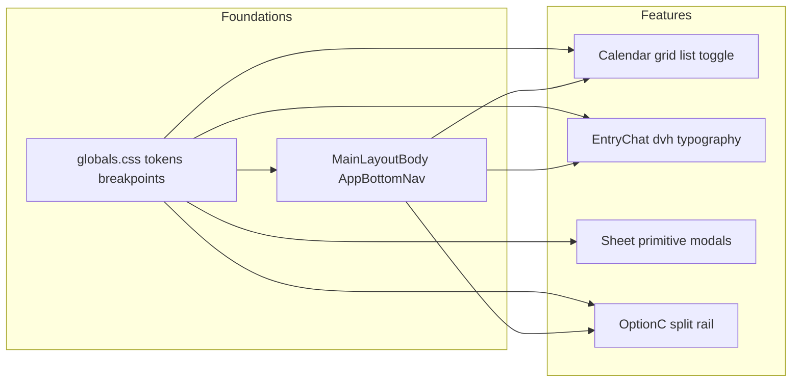

<!--
  Living document: responsive UI / Option C master–detail plan for daily-snap web.
  Keep in sync with the Cursor plan file when strategy changes.
-->

# Responsive UI improvement plan (daily-snap / web)

## Current state

- **Stack:** Next.js 16, React 19, Tailwind CSS v4 ([`web/src/app/globals.css`](../web/src/app/globals.css) — `@import "tailwindcss"` / `@theme inline`). No `tailwind.config` in use.
- **Shell:** [`web/src/components/main-layout-body.tsx`](../web/src/components/main-layout-body.tsx) adds bottom padding for the fixed nav + `env(safe-area-inset-bottom)`; [`web/src/components/app-bottom-nav.tsx`](../web/src/components/app-bottom-nav.tsx) applies safe-area on the nav. Good mobile-first baseline.
- **Breakpoints are local, not systematic:** [`web/src/app/(main)/today/page.tsx`](../web/src/app/(main)/today/page.tsx) and [`web/src/app/(main)/entries/[date]/page.tsx`](../web/src/app/(main)/entries/[date]/page.tsx) use `lg:` two-column layouts; [`web/src/app/(main)/calendar/calendar-client.tsx`](../web/src/app/(main)/calendar/calendar-client.tsx) uses `sm:` on the filter strip. Cross-cutting rules (touch size, type scale, motion) are not unified.
- **Pain points:** Chat panel height uses `vh` in [`web/src/app/(main)/entries/[date]/entry-chat.tsx`](../web/src/app/(main)/entries/[date]/entry-chat.tsx) — poor fit with mobile browser chrome. Month view is always 7 columns in [`web/src/app/(main)/calendar/month-grid.tsx`](../web/src/app/(main)/calendar/month-grid.tsx) — very dense on narrow widths. Settings uses `100dvh` in [`web/src/app/(main)/settings/settings-form.tsx`](../web/src/app/(main)/settings/settings-form.tsx) but is not a mobile “sheet” pattern.

## Goals (from product decisions)

| Area | Direction |
|------|-----------|
| Per-device UX | Change layout/density by width — do not rely on a single global `max-width` only. |
| Calendar (narrow) | User can switch **month grid** vs **list/agenda**; first visit defaults to **grid**; then **persist choice** (`localStorage` + optional **`?view=`** — **URL wins** when present). |
| Viewport height | Prefer **`dvh`** for chat/panels; use **`VisualViewport`** where the software keyboard still breaks layout. |
| Touch targets | Target **~48px** for primary interactive controls. |
| Typography | **Slightly larger** overall; reduce reliance on `text-[10px]` / `text-[11px]`. |
| Landscape | Prioritize **main flows** (today/entry chat, calendar, search). |
| Modals | **Bottom sheet** on small screens; introduce a **shared primitive** and migrate **2–3** call sites. |
| Breakpoints | **Custom** named breakpoints in CSS (`@theme`), kept to **3–4** tiers with a short comment contract in `globals.css`. |
| QA | **Manual** (DevTools presets) **+ Playwright** (snapshots or smoke). |
| Scope | **App-wide** — start from tokens + shell. |
| Zoom | **Allow user zoom** — do not lock `maximum-scale`. |

### Desktop navigation — Option C (chosen)

Options A/B/C were considered; **C is locked:** richer **per-route master–detail** at large widths (higher cost; needs a short spec).

- **Phase 1 split routes:** **`/calendar`** and **`/entries/*`** — master–detail adds the most value.
- **Stay single-column (for now):** **`/today`**, **`/settings`** — limits initial complexity.
- **Long-term:** **`/today` remains a first-class route** — fastest nav path to “today”; not replaced by redirect-only to `/calendar/{today}`.
- **Activate split at `lg` (1024px)** — avoids cramped split at ~768px (e.g. iPad portrait).
- **768px–1023px:** Keep **mobile chrome** (bottom nav, no split); use a **`max-w-2xl`-style** centered container so chat does not look stretched on wide tablets in portrait.
- **At `lg+`:** **Hide bottom nav** when **split + rail/sidebar** is shown; **rail must expose the same four destinations** as bottom nav (`/today`, `/calendar`, `/search`, `/settings`) so resizing never “removes” navigation.
- **Bullet-only RFC** before coding: left/right **slots**, **URL rules**, **nav parity**, **`/entries` index** behavior.
- **Calendar URL:** **`/calendar/YYYY-MM-DD`**; **redirect** legacy [`/calendar?ym=`](../web/src/app/(main)/calendar/page.tsx) as needed.
- **Bare `/calendar`:** Right pane shows **today (Asia/Tokyo)**; **recommended:** **redirect to `/calendar/{todayYmd}`** so URL matches content (Back/bookmarks). Document an exception only if bare `/calendar` must remain addressable.
- **`/entries`:** **`/entries`** = index (list/browse/search entry point); **`/entries/[date]`** = detail. Future e.g. **`/entries/stats`** as a sibling route is fine.
- **Keyboard (`lg+`):** **Esc** where it matches overlay/stack behavior; **`j`/`k`** only with **roving list focus** — never steal from chat **textarea**.
- **Tablet two-column (today/entry):** Prefer migrating from **`lg` only** toward **`md`** with ~58–62% for the chat column — tune after Option C landings.

## Architecture

## Implementation phases

### Phase 1 — Design tokens and custom breakpoints

- In [`web/src/app/globals.css`](../web/src/app/globals.css) `@theme inline`, add **custom `--breakpoint-*`** (team-agreed; e.g. optional `xs`, keep total tiers small) and optional **semantic spacing/font tokens** (“body min”, “label”).
- Replace ad-hoc `px` sizes gradually: e.g. bump **one step** on mobile for labels instead of many one-off values.

### Phase 2 — Shell and navigation

- [`web/src/components/main-layout-body.tsx`](../web/src/components/main-layout-body.tsx) / [`web/src/components/app-bottom-nav.tsx`](../web/src/components/app-bottom-nav.tsx): At **`lg+`**, implement **Option C** — hide bottom nav when **split + rail** is active; add **rail/sidebar** mirroring the four links; switch **`pb-[calc(...)]`** so main content is not double-padded.
- **~48px targets:** Adjust nav link **min-height / padding** on [`AppBottomNav`](../web/src/components/app-bottom-nav.tsx).

### Phase 3 — Calendar grid + list

- **Persistence:** **`localStorage`** for grid vs list + optional **`?view=grid|list`** (**query wins**).
- [`web/src/app/(main)/calendar/month-grid.tsx`](../web/src/app/(main)/calendar/month-grid.tsx): Keep grid; add **`MonthList`** (or sibling component) — chronological list with event counts / entry presence.
- [`web/src/app/(main)/calendar/calendar-client.tsx`](../web/src/app/(main)/calendar/calendar-client.tsx): Segment toggle near header.

### Phase 4 — Modal → mobile bottom sheet

- First target: calendar **`settingsOpen`** overlay in [`calendar-client.tsx`](../web/src/app/(main)/calendar/calendar-client.tsx).
- **Pattern:** Below **`md`**: `items-end`, top-rounded sheet, **`max-h-[90dvh]`**, scroll inside. **`md+`:** keep centered modal-like panel.
- Prefer the **shared sheet primitive** from the backlog; second wave: [`settings-form.tsx`](../web/src/app/(main)/settings/settings-form.tsx) full-screen panels if scope allows.

### Phase 5 — Chat, diary, today

- [`entry-chat.tsx`](../web/src/app/(main)/entries/[date]/entry-chat.tsx): **`vh` → `dvh`**; optional **`orientation: landscape`** tweaks; **VisualViewport** hook if keyboard still occludes composer.
- Send / header actions toward **48px** touch targets.
- [`today/page.tsx`](../web/src/app/(main)/today/page.tsx) / [`entries/[date]/page.tsx`](../web/src/app/(main)/entries/[date]/page.tsx): Consider **`md:grid-cols-12`** (e.g. ~7/5) vs **`lg` only** — validate sticky columns after typography bump.

### Phase 6 — Search and forms

- [`search-client.tsx`](../web/src/app/(main)/search/search-client.tsx): **`flex-col` / `sm:flex-row`**, full-width submit on narrow widths if needed.
- Onboarding / settings horizontal chips: re-check height/padding after font size increases.

### Phase 7 — QA

- **Manual:** iPhone SE, ~390px, 768px, 1280px, + landscape on key screens.
- **Playwright:** `tests/responsive/*.spec.ts` — `/today`, `/calendar`, `/entries/YYYY-MM-DD`, new **`/calendar/YYYY-MM-DD`** and **`/entries`** after routing work; auth strategy per existing setup (start with login or mocks if needed).

## Option C implementation notes (routing & UX)

- **URL sync:** Left-pane selection **updates the URL** (Back, bookmarks, share).
- **Loading UX:** Skeleton or **retain previous** right-pane content during navigation to limit CLS.
- **Migration:** Invalid dates → **`not-found`**; **canonical** strategy if old and new calendar URLs coexist briefly.
- **Parallel routes / `@slot`:** Optional Next.js pattern for independent loading of master vs detail — mention in RFC if used.
- **Scroll restoration:** Preserve left-list scroll on Back where cheap.
- **`/today` vs calendar right pane:** Reuse the same building blocks as **`/entries/[todayYmd]`** where possible to avoid duplicate logic.

## Cross-cutting backlog (quality)

| Area | Action |
|------|--------|
| Metadata | `metadata.viewport` + `themeColor` in [`layout.tsx`](../web/src/app/layout.tsx); document **allow zoom**. |
| A11y | Focus **into** sheet on open, **restore** on close; **focus trap**; align **Esc** with calendar settings behavior. |
| Motion | `prefers-reduced-motion` for sheet/nav motion. |
| Scroll | `overscroll-behavior-x`, `scroll-padding` vs bottom nav on horizontal chips. |
| DnD | Larger handles / touch thresholds for @dnd-kit on small screens. |
| Images | Responsive `sizes` / max-width for entry images. |
| Performance | Watch **CLS** after type/spacing changes; optional list **virtualization** later for long month lists. |
| Shortcuts | Document no conflict with **screen readers**; optional settings UI for shortcut hints later. |

## Bullet RFC — Option C (slots, URL, nav)

- **Left / right slots:** Calendar and entries use a **master list (left)** and **detail / main (right)** at `lg+`; `/today` and `/settings` stay a **single centered column** in phase 1.
- **URL rules:** Calendar canonical path is **`/calendar/YYYY-MM-DD`**; bare `/calendar` redirects to **today (Asia/Tokyo)**; legacy **`?ym=`** redirects into the dated URL where applicable. Entries: **`/entries`** = index; **`/entries/[date]`** = day detail.
- **Nav parity:** At `lg+`, the **left rail** exposes the same four destinations as the bottom nav (`/today`, `/calendar`, `/search`, `/settings`) so navigation is never “missing” when the bottom bar hides.
- **`/entries` index:** Lists recent or browsable entries as the **entry point**; detail remains **`/entries/[date]`** (room for future siblings like `/entries/stats`).

## Risks

- **Authenticated E2E** needs session/bootstrap; if none exists, start with **login** flow or **mocks**.
- Too many **custom breakpoints** hurts maintainability — cap at **3–4** and document in `globals.css`.
- Larger type **increases line count** — ship **calendar list view** in the same release wave to absorb density.

## Definition of done (proposal)

- On **three representative widths** + landscape, core flows complete **without horizontal scroll** (except intentional horizontal chip strips).
- Primary actions sit near **48px** touch targets.
- At least **one** Playwright spec runs in **CI or documented local** workflow.
- **Option C:** At **`lg+`**, `/calendar` and `/entries` show **master–detail + rail**; **`/today`** and **`/settings`** remain **centered single-column** for phase 1; **`/today`** stays a **dedicated route** long-term.

## Task checklist (YAML todos live in Cursor plan)

Track in Cursor: `theme-breakpoints`, `shell-nav-lg`, `calendar-grid-list`, `modal-bottom-sheet`, `entry-chat-dvh`, `today-entry-md-grid`, `search-forms-responsive`, `playwright-responsive`, `meta-viewport-theme`, `a11y-sheet-focus`, `reduced-motion`, `touch-dnd-review`, `images-responsive`, `sheet-primitive`, `visual-viewport-keyboard`, `desktop-split-layouts`, `url-sync-master-detail`, `keyboard-shortcuts-lg`, `bullet-rfc-option-c`.
